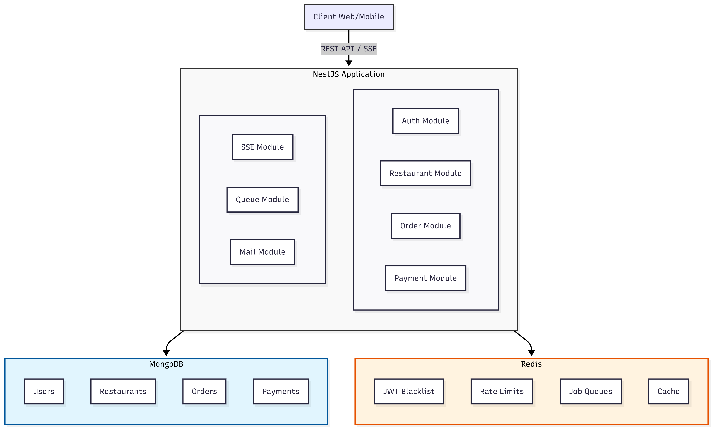
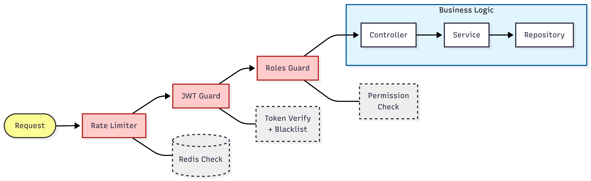

<div align="center">

# Multi-Restaurant Manager

**A production-ready NestJS backend for managing multiple restaurants**

[](https://nestjs.com/)
[](https://www.typescriptlang.org/)
[](https://www.mongodb.com/)
[](https://redis.io/)
[](LICENSE)

[Features](#features) • [Getting Started](#getting-started) • [API Documentation](#api-documentation) • [Architecture](#architecture) • [Contributing](#contributing)

</div>

---

## Overview

Multi-Restaurant Manager is a comprehensive backend solution designed for restaurant chains and food service businesses. Built with **NestJS** and following industry best practices, it provides a robust foundation for managing restaurants, orders, payments, and staff across multiple locations.

## Features

### Core Functionality
- **Restaurant Management** — Create and manage multiple restaurants with detailed profiles
- **Menu Management** — Dynamic menu items with categories, pricing, and availability
- **Table Management** — Visual table layouts with real-time status tracking
- **Order Processing** — Full order lifecycle from draft to completion
- **Payment Integration** — Cash and QR code payment methods
- **Staff Management** — Role-based staff assignment with shift tracking

### Security & Authentication
- **JWT Authentication** — Access/Refresh token pattern with automatic rotation
- **Two-Factor Authentication** — Email-based OTP for enhanced security
- **Session Management** — Multi-device support with session tracking
- **OAuth2 Integration** — Google authentication support
- **Rate Limiting** — Configurable throttling per endpoint
- **Role-Based Access** — Granular permission system (`admin`, `owner`, `manager`, `cashier`, `waiter`, `kitchen`)

### Technical Highlights
- **Real-Time Updates** — Server-Sent Events (SSE) for live order notifications
- **Background Jobs** — BullMQ for async tasks (emails, notifications)
- **Structured Logging** — Winston with daily log rotation
- **API Documentation** — Auto-generated Swagger/OpenAPI docs
- **Request Validation** — Class-validator with custom pipes

## Tech Stack

| Category | Technology |
|----------|------------|
| **Framework** | NestJS 11 (Express) |
| **Language** | TypeScript 5.7 |
| **Database** | MongoDB + Mongoose ODM |
| **Cache/Queue** | Redis + ioredis |
| **Job Queue** | BullMQ |
| **Authentication** | JWT, Passport, bcrypt |
| **Email** | Nodemailer |
| **Documentation** | Swagger/OpenAPI |
| **Logging** | Winston |

## Getting Started

### Prerequisites

- **Node.js** >= 20.x
- **pnpm** >= 8.x (recommended) or npm
- **MongoDB** >= 6.x
- **Redis** >= 7.x

### Installation

```bash
# Clone the repository
git clone https://github.com/dinhdev-nu/multi-restaurant-manager-nestjs.git
cd multi-restaurant-manager-nestjs

# Install dependencies
pnpm install

# Copy environment file
cp .env.example .env
```

### Configuration

Edit the `.env` file with your settings:

```env
# Server
NODE_ENV=development
HOST=localhost
PORT=3000

# Database
MONGO_URI=mongodb://localhost:27017/restaurant-manager

# Redis
REDIS_HOST=localhost
REDIS_PORT=6379
REDIS_DB=0

# JWT
JWT_ACCESS_SECRET=your-access-secret
JWT_ACCESS_TTL=15m
JWT_REFRESH_SECRET=your-refresh-secret
JWT_REFRESH_TTL=7d

# Email (SMTP)
SMTP_SERVICE=gmail
SMTP_USER=your-email@gmail.com
SMTP_PASSWORD=your-app-password

# OAuth (optional)
GOOGLE_CLIENT_ID=your-google-client-id
GOOGLE_CLIENT_SECRET=your-google-client-secret
GOOGLE_REDIRECT_URI=http://localhost:3000/auths/oauth/google/callback

# Client
CLIENT_URL=http://localhost:3001
```

### Running the Application

```bash
# Development
pnpm run start:dev

# Production build
pnpm run build
pnpm run start:prod

# Debug mode
pnpm run start:debug
```

The API will be available at `http://localhost:3000`

## API Documentation

Once the server is running, access the interactive API documentation:

- **Swagger UI**: [http://localhost:3000/docs](http://localhost:3000/docs)
- **OpenAPI JSON**: [http://localhost:3000/docs-json](http://localhost:3000/docs-json)

### API Overview

| Module | Base Path | Description |
|--------|-----------|-------------|
| **Auth** | `/auths` | Authentication, registration, 2FA, sessions |
| **Restaurant** | `/restaurants` | Restaurant CRUD, menu, tables, staff |
| **Order** | `/orders` | Order management and status tracking |
| **Payment** | `/payments` | Payment processing |
| **Events** | `/events` | Real-time SSE subscriptions |

<details>
<summary><strong>Authentication Endpoints</strong></summary>

| Method | Endpoint | Description |
|--------|----------|-------------|
| `POST` | `/auths/register` | Register new account |
| `POST` | `/auths/login` | Login with email/phone |
| `POST` | `/auths/verify-otp` | Verify email OTP |
| `POST` | `/auths/refresh-token` | Refresh access token |
| `POST` | `/auths/logout` | Logout current session |
| `POST` | `/auths/logout-all` | Logout all sessions |
| `POST` | `/auths/forgot-password` | Request password reset |
| `POST` | `/auths/reset-password` | Set new password |
| `POST` | `/auths/2fa/enable` | Enable two-factor auth |
| `POST` | `/auths/2fa/send-otp` | Send 2FA OTP |
| `GET` | `/auths/sessions` | List active sessions |
| `DELETE` | `/auths/sessions` | Revoke session |

</details>

<details>
<summary><strong>Restaurant Endpoints</strong></summary>

| Method | Endpoint | Description |
|--------|----------|-------------|
| `POST` | `/restaurants` | Create restaurant |
| `PUT` | `/restaurants/:id` | Update restaurant |
| `GET` | `/restaurants/my-restaurants` | Get user's restaurants |
| `GET` | `/restaurants/detail/:id` | Get restaurant details |
| `POST` | `/restaurants/:id/open` | Open restaurant |
| `POST` | `/restaurants/:id/close` | Close restaurant |
| `POST` | `/restaurants/item` | Create menu item |
| `GET` | `/restaurants/:id/items` | Get menu items |
| `POST` | `/restaurants/table` | Create table |
| `GET` | `/restaurants/:id/tables` | Get tables |
| `POST` | `/restaurants/staff` | Add staff member |
| `GET` | `/restaurants/:id/staffs` | Get staff list |

</details>

<details>
<summary><strong>Order Endpoints</strong></summary>

| Method | Endpoint | Description |
|--------|----------|-------------|
| `POST` | `/orders` | Create order |
| `POST` | `/orders/draft` | Create draft order |
| `GET` | `/orders/drafts/:restaurantId` | Get draft orders |
| `POST` | `/orders/change-status` | Update order status |
| `GET` | `/orders/:restaurantId` | Get orders (paginated) |
| `GET` | `/orders/checkout/:orderId` | Get checkout details |

</details>

## Architecture

### Project Structure

```
src/
├── main.ts                 # Application entry point
├── app.module.ts           # Root module
├── common/                 # Shared utilities
│   ├── configs/            # Validation pipes
│   ├── constants/          # Error codes, roles, tokens
│   ├── decorators/         # Custom decorators
│   ├── dto/                # Shared DTOs
│   ├── exceptions/         # Custom exceptions
│   ├── filters/            # Exception filters
│   ├── guards/             # Auth guards
│   ├── interceptors/       # Logging, transform
│   ├── interfaces/         # Type definitions
│   ├── middlewares/        # Request middlewares
│   ├── pipes/              # Validation pipes
│   ├── repositories/       # Base repository
│   ├── swagger/            # Swagger utilities
│   └── utils/              # Helper functions
├── config/                 # Configuration module
├── databases/              # Database connections
│   ├── mongo/              # MongoDB setup
│   └── redis/              # Redis setup
├── logger/                 # Winston logging
├── queue/                  # BullMQ jobs
├── shared/                 # Shared services
│   ├── mail/               # Email service
│   └── throttler/          # Rate limiting
└── modules/                # Feature modules
    ├── auth/               # Authentication
    ├── restaurant/         # Restaurants
    ├── order/              # Orders
    ├── payment/            # Payments
    └── sse/                # Server-Sent Events
```

### System Architecture



### Database Models


### Security Flow



## Scripts

| Command | Description |
|---------|-------------|
| `pnpm start` | Start the application |
| `pnpm start:dev` | Start in watch mode |
| `pnpm start:debug` | Start with debugger |
| `pnpm start:prod` | Start production build |
| `pnpm build` | Build the application |
| `pnpm lint` | Run ESLint |
| `pnpm test` | Run unit tests |
| `pnpm test:e2e` | Run E2E tests |
| `pnpm test:cov` | Run tests with coverage |

## Environment Variables

| Variable | Description | Default |
|----------|-------------|---------|
| `NODE_ENV` | Environment mode | `development` |
| `PORT` | Server port | `3000` |
| `MONGO_URI` | MongoDB connection string | — |
| `REDIS_HOST` | Redis host | `localhost` |
| `REDIS_PORT` | Redis port | `6379` |
| `JWT_ACCESS_SECRET` | Access token secret | — |
| `JWT_ACCESS_TTL` | Access token TTL | `15m` |
| `JWT_REFRESH_SECRET` | Refresh token secret | — |
| `JWT_REFRESH_TTL` | Refresh token TTL | `7d` |
| `THROTTLE_TTL` | Rate limit window (sec) | `60` |
| `THROTTLE_LIMIT` | Max requests per window | `10` |

See `.env.example` for the complete list.

## Contributing

Contributions are welcome! Please follow these steps:

1. Fork the repository
2. Create a feature branch (`git checkout -b feature/amazing-feature`)
3. Commit your changes (`git commit -m 'Add amazing feature'`)
4. Push to the branch (`git push origin feature/amazing-feature`)
5. Open a Pull Request

### Development Guidelines

- Follow the existing code style and conventions
- Write meaningful commit messages
- Add tests for new features
- Update documentation as needed

## License

This project is licensed under the MIT License — see the [LICENSE](LICENSE) file for details.

---

<div align="center">

**Built with NestJS**

[Report Bug](https://github.com/dinhdev-nu/multi-restaurant-manager-nestjs/issues) • [Request Feature](https://github.com/dinhdev-nu/multi-restaurant-manager-nestjs/issues)

</div>
